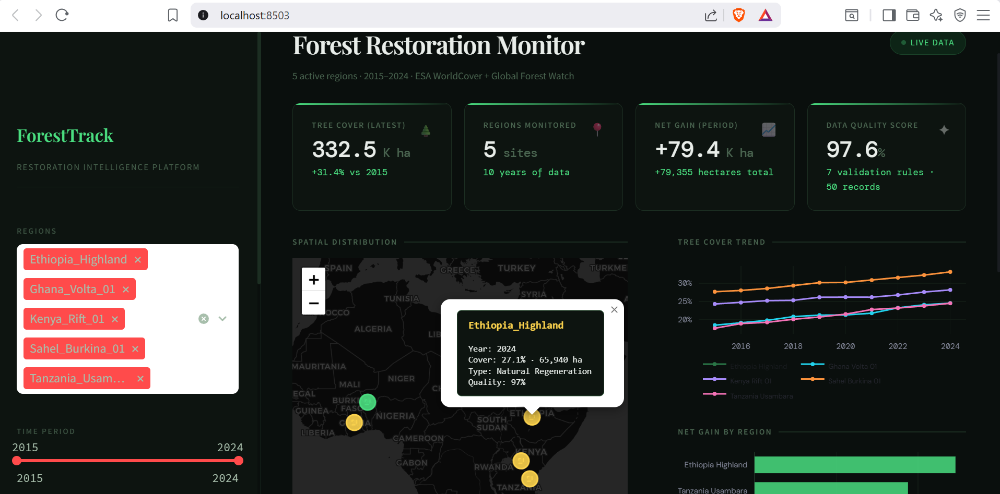
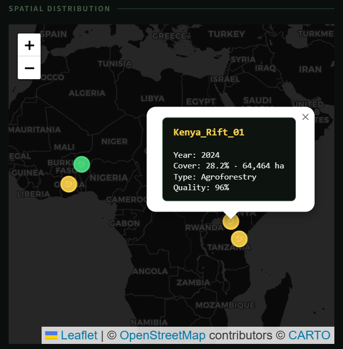
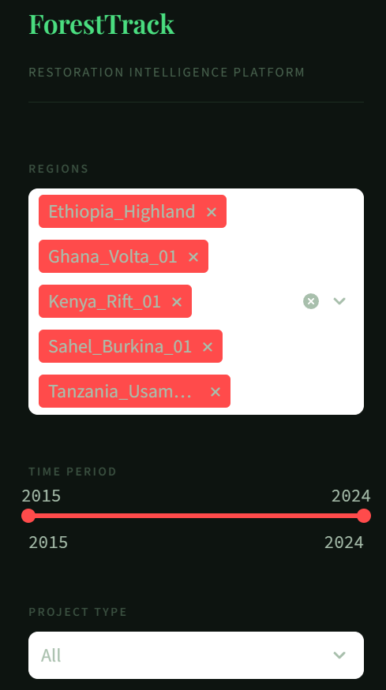
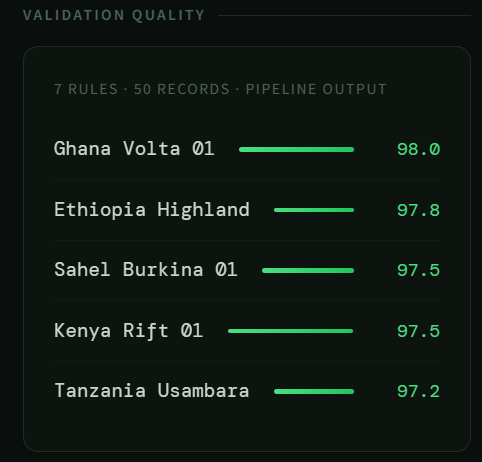

# Forest Restoration Monitoring Dashboard

A full-stack geospatial platform tracking reforestation across Africa.

> Amisha Ganvir - MPS Data Science, UMBC

## The Problem

Reforestation programs generate enormous satellite imagery but program managers have no easy way to see if interventions are working. This bridges that gap.

## What It Tracks

5 regions across West and East Africa, 2015-2024. 332,456 ha monitored, +62,626 ha net gain, 97.6% data quality score.

## Map

## Charts

## Data Quality

## Stack

Python 3.11, GeoPandas, Rasterio, PostgreSQL + PostGIS, Streamlit, Folium, Plotly

## About

Amisha Ganvir, github.com/HEX027
